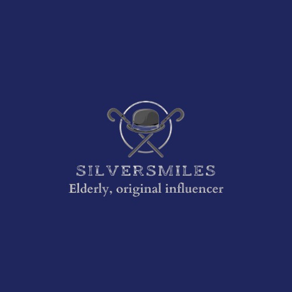
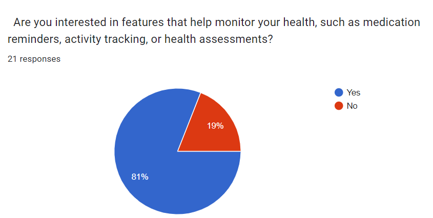
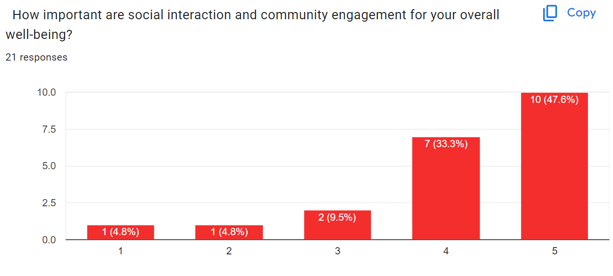
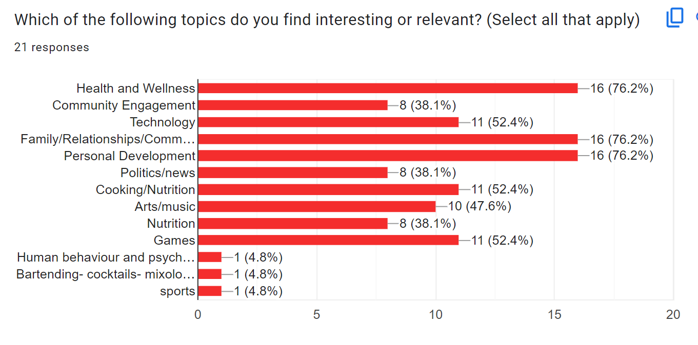
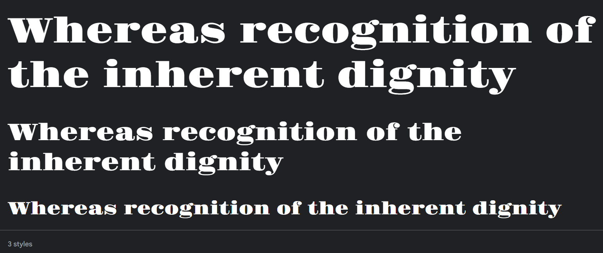
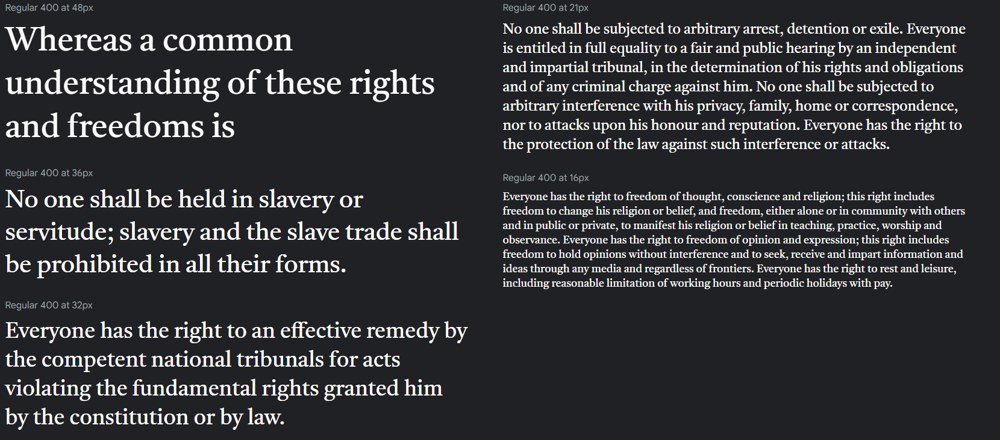

 

 
## Introduction

As technology advances and life expectancy increases, the aging population often feels left-out due to inaccessible technology. This problem became evident during the Covid-19 pandemic, as the world heavily relied on digital connectivity, and social isolation affecting seniors’ physical and mental health. 

Our mission is to close the gap with SilverSmiles, an app that engaged the elderly in the development process, and that is specifically tailored to their nuanced needs.

## Understanding the problem

Diving deeper into the elderly-technology gap, low vision and hearing impairments become significant barriers to digital engagement, and are rarely taken into consideration when developing a digital product. The challenge extends beyond physical limitations. Psychological factors such as motivation, patience, trust, privacy, and attitude hugely influence the aging population and their willingness to embrace technological changes.  (to be edited)

## Our solution 

It is very important to ask the concerned users what are their needs, and how we can meet them. That is why our team conducted a survey with very specific questions that target seniors’ diverse needs. Those questions are mostly focused on the health aspect of our users. 

Our app aims to not only encourage socialization and physical activity, but it also serves as a motivational tool for users to delve into their hobbies and lead more vibrant lives. Most importantly, the application would foster a sense of purpose and joy among seniors. (to be edited)

## The Research

### Purpose

In the pursuit of designing an application catered to the well-being of the elderly, we initiated a comprehensive survey aimed at unraveling key insights from various perspectives. With a focus on individuals aged 60 and above, the survey encompassed diverse topics, ranging from technology comfort levels to preferences in social interaction and health-monitoring features. For a holistic understanding, we extended an invitation to those not within the elderly demographic to imagine and respond on behalf of an elderly person they know well. The objective was to capture nuanced insights into the potential needs and preferences of the elderly demographic, ensuring our application is both inclusive and responsive to their diverse requirements. The survey served as a pivotal tool in unveiling essential user perspectives, guiding our design decisions towards creating a truly user-centric solution.

### Results

### Analysis
As we can see from the results, almost all participants would rely on an app to help them monitor their health. Particularly, an app that provides medication reminders. In addition,  

## User Personas

 
 
 
 

 ## Color Palette
In designing our app, SilverSmiles, tailored for the elderly, we prioritized a color palette that enhances visibility, readability, and emotional well-being.  We meticulously chose our colors based on a <a href="https://eldertech.org/color-in-designing-technology-for-seniors/#:~:text=Navy%20blue%2C%20sky%20blue%2C%20and%20aquamarine%20are%20particular,Blue%20can%20reduce%20mental%20excitability%20and%20help%20concentration" target="_blank"> past research</a> involving elderly participants, aiming to identify color preferences among our target demographic. 

High contrast between text and background colors was a critical factor, ensuring that all information is easily readable for users with varying degrees of vision clarity, and carefully considering the needs of those with color blindness. 
 The formal names of the colors that we opted for in the app are : 

 -Space cadet 
 
 -Deep Carmine Pink
 
 -Quartz
 
 -Light Silver
 

 

 
 

## Typography

We chose 2 fonts for our app: Gravitas One, and Tiro Bangla. Both embody a sense of safety and elegance. However, the reason for two fonts is that we wanted to make a distinction between the primary elements of the app such as buttons and headers (represented with Gravitas One), and the secondary elements of the app, which are instructions for the users to guide them in the navigation of the app (represented with Tiro Bangla). 

#### Gravitas One

 

 
 

 
#### Tiro Bangla

 

 
 

## Name 

The name "SilverSmiles" was carefully crafted to reflect both the dignity and the joy of aging. We chose "Silver" to honor the wisdom and experience that comes with age, symbolizing the richness of life's journey. "Smiles" was selected to represent the essence of happiness, positivity, and connection that we aim to foster within our community of elderly users. By combining these elements, we wanted to create a name that not only acknowledges the challenges of aging but also celebrates the moments of laughter, camaraderie, and fulfillment that are integral to the senior experience. Our purpose in choosing this name was to create a platform that not only provides support and resources for the elderly but also cultivates a sense of belonging, purpose, and joy in their lives, ultimately promoting their overall well-being and quality of life.

## LOGO

The logo of SilverSmiles features an old-fashioned hat with two canes crossed behind it, chosen for its symbolic representation of tradition, stability, and support. The hat conjures images of a bygone era, evoking nostalgia and honoring the rich life experiences of the elderly. The crossed canes serve as visual cues of assistance and guidance, reflecting our commitment to providing support and care for our elderly users. The phrase "Elderly, original influencer" accompanying the logo further emphasizes our recognition of the senior population as influential individuals with valuable insights and perspectives to share. Through this logo, we aim to convey a message of respect, empowerment, and inclusivity, while also signifying our mission to enrich the lives of the elderly by fostering connections, promoting well-being, and celebrating their contributions to society

 ## Brand Story 

Help elderly people to enhance their mental well being by socializing with other elderly having the same interests, plus reminding them with their medications.

## Final design

We gathered the results of our survey to design the app in a way it makes our target users satisfied. 

## Conclusion

In conclusion, the SilverSmiles project represents a heartfelt commitment to honoring and empowering the elderly community. Through thoughtful branding, including the carefully chosen name and logo, we have endeavored to create more than just an app; we've built a supportive and inclusive digital space where seniors can find companionship, resources, and joy. By recognizing the wisdom and influence of our elderly users and providing them with the tools and support they need, SilverSmiles aims to enhance their quality of life, foster connections, and celebrate the invaluable contributions they continue to make to society. As we embark on this journey, we are inspired by the opportunity to make a meaningful difference in the lives of our beloved seniors, ensuring that their silver years are filled with smiles, laughter, and fulfillment.

 ## References
 https://eldertech.org/color-in-designing-technology-for-seniors/#:~:text=Navy%20blue%2C%20sky%20blue%2C%20and%20aquamarine%20are%20particular,Blue%20can%20reduce%20mental%20excitability%20and%20help%20concentration.
