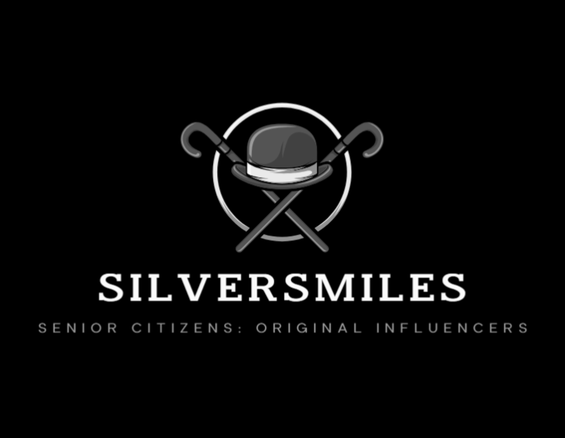

 

## Introduction

As technology advances and life expectancy increases, the aging population often feels left-out due to inaccessible technology. This problem became evident during the Covid-19 pandemic, as the world heavily relied on digital connectivity, and social isolation affecting seniors’ physical and mental health. 

Our mission is to close the gap with SilverSmiles, an app that engaged the elderly in the development process, and that is specifically tailored to their nuanced needs.

## Understanding the problem

Diving deeper into the elderly-technology gap, low vision and hearing impairments become significant barriers to digital engagement, and are rarely taken into consideration when developing a digital product. The challenge extends beyond physical limitations. Psychological factors such as motivation, patience, trust, privacy, and attitude hugely influence the aging population and their willingness to embrace technological changes.  (to be edited)

## Our solution 

It is very important to ask the concerned users what are their needs, and how we can meet them. That is why our team conducted a survey with very specific questions that target seniors’ diverse needs. Those questions are mostly focused on the health aspect of our users. 

Our app aims to not only encourage socialization and physical activity, but it also serves as a motivational tool for users to delve into their hobbies and lead more vibrant lives. Most importantly, the application would foster a sense of purpose and joy among seniors. (to be edited)

## The Research

### Survey

In the pursuit of designing an application catered to the well-being of the elderly, we initiated a comprehensive survey aimed at unraveling key insights from various perspectives. With a focus on individuals aged 60 and above, the survey encompassed diverse topics, ranging from technology comfort levels to preferences in social interaction and health-monitoring features. For a holistic understanding, we extended an invitation to those not within the elderly demographic to imagine and respond on behalf of an elderly person they know well. The objective was to capture nuanced insights into the potential needs and preferences of the elderly demographic, ensuring our application is both inclusive and responsive to their diverse requirements. The survey served as a pivotal tool in unveiling essential user perspectives, guiding our design decisions towards creating a truly user-centric solution.

## User Personas

 
 
 
 

 
