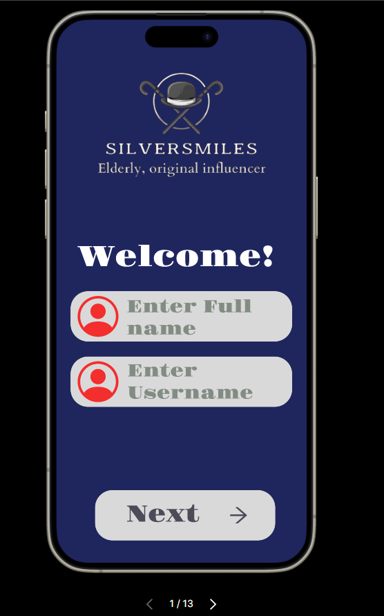

 

## The Team

 Christa Abou Arraje -- 40226631

 Ibrahim Elyyan -- 40167982

 Jose Semaan -- 40244141

 The link: https://christa-ux.github.io/SilverSmiles/   
 
## Introduction

As technology advances and life expectancy increases, the aging population often feels left-out due to inaccessible technology. This problem became evident during the Covid-19 pandemic, as the world heavily relied on digital connectivity, and social isolation affecting seniors’ physical and mental health. 

Our mission is to close the gap with SilverSmiles, an app that engaged the elderly in the development process, and that is specifically tailored to their nuanced needs.

## Understanding the problem

Diving deeper into the elderly-technology gap, low vision and hearing impairments become significant barriers to digital engagement, and are rarely taken into consideration when developing a digital product. The challenge extends beyond physical limitations. Psychological factors such as motivation, patience, trust, privacy, and attitude hugely influence the aging population and their willingness to embrace technological changes.  (to be edited)

## Our solution 

It is very important to ask the concerned users what are their needs, and how we can meet them. That is why our team conducted a survey with very specific questions that target seniors’ diverse needs. Those questions are mostly focused on the health aspect of our users. 

Our app aims to encourage socialization, and it also serves as a motivational tool for users to delve into their hobbies and lead more vibrant lives. Most importantly, the application would foster a sense of purpose and joy among seniors. 

## Market Research 

Research by <a href="https://www.pewresearch.org/internet/2017/05/17/technology-use-among-seniors/" target="_blank"> Pew Research Center </a> reveals that while there's a digital divide, a significant portion of seniors are more connected than ever. Approximately four in ten seniors now own smartphones, a figure that has more than doubled since 2013. Internet use among seniors has steadily increased, with 67% of those aged 65 and older reporting they go online, and about half (51%) having high-speed internet at home. Additionally, social media use among this demographic has been on the rise, with 34% of Americans aged 65 and up engaging in social networking sites, marking a seven-point increase from 2013

Further insights from <a href="https://www.thinkwithgoogle.com/consumer-insights/consumer-trends/digital-seniors/" target="_blank">Think with Google </a> underscore the stereotype-breaking digital habits of today's seniors. A majority of online seniors spend at least six hours a day online and own an average of five devices, showcasing a group that's deeply engaged with the digital world. These "digital seniors" are not only avid internet users but also active on platforms like YouTube, reflecting their enthusiasm for staying connected and updated with technology. This demographic's digital literacy is significant, with 86% being classified as tech enthusiasts who are actively seeking out digital content for various purposes, including health and wellness and staying in touch with friends and family. 

## Our Research

### Purpose

In the pursuit of designing an application catered to the well-being of the elderly, we initiated a comprehensive survey aimed at unraveling key insights from various perspectives. With a focus on individuals aged 60 and above, the survey encompassed diverse topics, ranging from technology comfort levels to preferences in social interaction and health-monitoring features. For a holistic understanding, we extended an invitation to those not within the elderly demographic to imagine and respond on behalf of an elderly person they know well. The objective was to capture nuanced insights into the potential needs and preferences of the elderly demographic, ensuring our application is both inclusive and responsive to their diverse requirements. The survey served as a pivotal tool in unveiling essential user perspectives, guiding our design decisions towards creating a truly user-centric solution.

### Results

### Analysis
As we can see from the results, 81% of people who participated in the survey would rely on an app to help them monitor their health. They would particularly want an app that provides medication reminders. In addition, almost 50% of the participants highly value social interaction and community engagement for their well-being. 76.2% of participants found health and wellness, family/relationships/communications, and personal development the most interesting. In second place with 52.4% is cooking/nutrition. From the survey results, the SilverSmiles development team designed the app to aid the elderly in taking part in what they find interesting, to better their health and well-being. As shown in the user flow and sketches below, the app mainly revolves around old people being able to communicate and talk about cooking, music, and reading.

## User Personas

 
 
 
 

#### Why did we choose those personas? 

Isabelle, Marie, and Jaques are the personas chosen for SilverSmiles because they represent a wide range of the elderly, each with their own goals and needs that align with the mission of the project.
The development team uses these personas to understand users’s needs, goals, and experiences. Thus, enabling the team to design an app that caters to user needs and is user-centric. SilverSmiles can ensure accessibility and inclusivity with benefits to a diverse range of elderly users by focusing on these personas.

#### Isabelle's user goals 

When creating Isabelle’s persona, we can see that she wants to stay informed, manage her health,  explore new hobbies, and share the pleasures of life with her family. Her goals align with the goals of SilverSmiles, which is to help elders stimulate their minds through various activities and lead vibrant lives. As with the other personas, Isabelle doesn't want a complicated experience, she just wants an app that is easy and simple to use, which helps her be healthy and experience new activities

#### Jacques' user goals 

 With Marie’s persona, her goals are to combat loneliness, stay connected with friends and family, engage in various activities, and easily access food services through the app. SilverSmiles goals help achieve that because we want to foster connections among elders and help them find companionship.

#### Marie's user goals 

 For Jaques’s persona, he aims to connect with his friends, be a part of hobby groups with similar interests, and receive personalized messages when he achieves a milestone or completes an activity. SilverSmiles wants to accomplish this by making a community for seniors, specifically for the ones that live alone.

## Isabelle Lavoie's User Journey
 Delving into Isabelle's user journey allows us to understand and discover potential troubles users may encounter. Additionally, it enables us to avoid or mitigate these issues in the future. 

 

 
 

## User Flow

 
 
 
 
 
 

## The Full Flow Chart

 
 

## Sketches
 

## Wireframe
 

## Color Palette
In designing our app, SilverSmiles, tailored for the elderly, we prioritized a color palette that enhances visibility, readability, and emotional well-being.  We meticulously chose our colors based on a <a href="https://eldertech.org/color-in-designing-technology-for-seniors/#:~:text=Navy%20blue%2C%20sky%20blue%2C%20and%20aquamarine%20are%20particular,Blue%20can%20reduce%20mental%20excitability%20and%20help%20concentration" target="_blank"> past research</a> involving elderly participants, aiming to identify color preferences among our target demographic. 

High contrast between text and background colors was a critical factor, ensuring that all information is easily readable for users with varying degrees of vision clarity, and carefully considering the needs of those with color blindness. 
 The formal names of the colors that we opted for in the app are : 

 -Space cadet 
 
 -Deep Carmine Pink
 
 -Quartz
 
 -Light Silver
 

 

 
 

## Typography

We chose 2 fonts for our app: Gravitas One, and Tiro Bangla. Both embody a sense of safety and elegance. However, the reason for two fonts is that we wanted to make a distinction between the primary elements of the app such as buttons and headers (represented with Gravitas One), and the secondary elements of the app, which are instructions for the users to guide them in the navigation of the app (represented with Tiro Bangla). 

#### Gravitas One

 

 
 

 
#### Tiro Bangla

 

 
 

## Name 

The name "SilverSmiles" was carefully crafted to reflect both the dignity and the joy of aging. We chose "Silver" to honor the wisdom and experience that comes with age, symbolizing the richness of life's journey. "Smiles" was selected to represent the essence of happiness, positivity, and connection that we aim to foster within our community of elderly users. By combining these elements, we wanted to create a name that not only acknowledges the challenges of aging but also celebrates the moments of laughter, camaraderie, and fulfillment that are integral to the senior experience. Our purpose in choosing this name was to create a platform that not only provides support and resources for the elderly but also cultivates a sense of belonging, purpose, and joy in their lives, ultimately promoting their overall well-being and quality of life.

## LOGO

The logo of SilverSmiles features an old-fashioned hat with two canes crossed behind it, chosen for its symbolic representation of tradition, stability, and support. The hat conjures images of a bygone era, evoking nostalgia and honoring the rich life experiences of the elderly. The crossed canes serve as visual cues of assistance and guidance, reflecting our commitment to providing support and care for our elderly users. The phrase "Elderly, original influencer" accompanying the logo further emphasizes our recognition of the senior population as influential individuals with valuable insights and perspectives to share. Through this logo, we aim to convey a message of respect, empowerment, and inclusivity, while also signifying our mission to enrich the lives of the elderly by fostering connections, promoting well-being, and celebrating their contributions to society

## Brand Story 

To help the elderly people enhance their mental well-being by socializing with other elderly having the same interests, as well as reminding them with their medications.

## Final design

## Conclusion

In conclusion, the SilverSmiles project represents a heartfelt commitment to honoring and empowering the elderly community. Through thoughtful branding, including the carefully chosen name and logo, we have endeavored to create more than just an app; we've built a supportive and inclusive digital space where seniors can find companionship, resources, and joy. By recognizing the wisdom and influence of our elderly users and providing them with the tools and support they need, SilverSmiles aims to enhance their quality of life, foster connections, and celebrate the invaluable contributions they continue to make to society. As we embark on this journey, we are inspired by the opportunity to make a meaningful difference in the lives of our beloved seniors, ensuring that their silver years are filled with smiles, laughter, and fulfillment.

## References

<a href="https://eldertech.org/color-in-designing-technology-for-seniors/#:~:text=Navy%20blue%2C%20sky%20blue%2C%20and%20aquamarine%20are%20particular,Blue%20can%20reduce%20mental%20excitability%20and%20help%20concentration" target="_blank"> Elderly Colors </a>

<a href="https://www.pewresearch.org/internet/2017/05/17/technology-use-among-seniors/" target="_blank"> Pew Research Center </a>

<a href="https://www.thinkwithgoogle.com/consumer-insights/consumer-trends/digital-seniors/" target="_blank">Think with Google </a>
